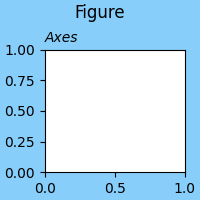
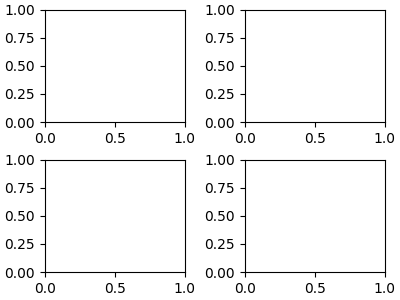
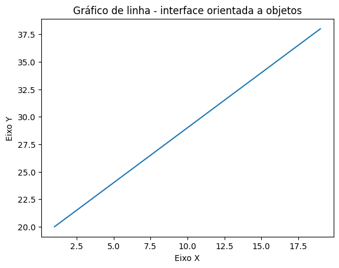
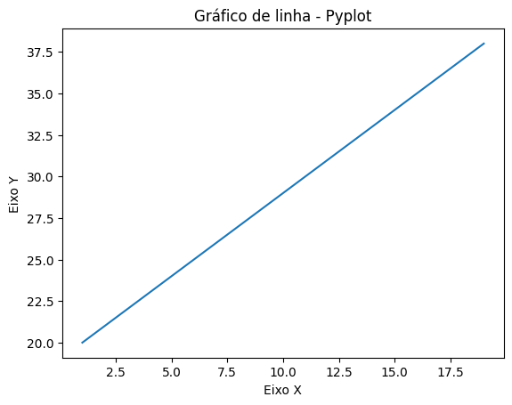

# **Visualização de dados**
Este repositório contém os materiais utilizados nas aulas do módulo 2, no curso da Udemy.
***

# **1. O horizonte de DataViz com Python e o objetivo deste módulo**

Desde um simples gráfico de barras a um dashboard interativo, com a linguagem Python tem-se diversas ferramentas para visualização de dados e personalização gráfica. Entre elas podem-se destacar as bibliotecas Matplotlib, Seaborn, Plotly, Dash.
<br>

Com todo esse recurso, o horizonte de possibilidades é bastante amplo. 
<br>

## **Gráficos comuns**

### Gráfico de dispersão


### Histograma


## **Gráficos avançados**

### Gráfico de linhas sobre trabalho infantil
 <br>
[Fonte](https://python-graph-gallery.com/web-lineplots-and-area-chart-the-economist/)

### Gráfico lolipop mostrando as avaliações por temporada da série *The Office*
<br>
[Fonte](https://python-graph-gallery.com/web-lollipop-plot-with-python-the-office/)

## **Dashboards**
### [Sistema de controle de produção](https://dash.gallery/dash-manufacture-spc-dashboard/)
[Fonte](https://github.com/plotly/dash-sample-apps/tree/main/apps/dash-manufacture-spc-dashboard)
<br>

> Precisamos, portanto, ter um objetivo bem definido diante das possibilidades.

Com o foco do nosso curso sendo uma abordagem geral sobre a linguagem Python para análise de dados, vamos estudar, neste módulo, a criação de gráficos com a biblioteca Matplotlib, especificamente:
- Componentes de um gráfico Matplotlib;
- Abordagens de sintaxe da biblioteca;
- Escolha do tipo de gráfico adequado ao problema;
- Criação de gráficos para visualização de categorias, correlações, distribuições e evoluções;
- Boas práticas na estilização de gráficos;
- Uma pitada sobre storytelling.
<br><br>

# **2. Biblioteca Matplotlib**

[Matplotlib](https://matplotlib.org/) é uma biblioteca *open-source* desenvolvida para Python no ano de 2003, para a geração de gráficos.<br>
Uma das motivações para a criação da biblioteca foi o objetivo de oferecer a mesma usabilidade do software MATLAB, dentro do Python, por meio do módulo Pytplot (veremos isso em sequência).<br>
É uma bilbioteca que oferece grande liberdade para manipulação dos elementos de um gráfico e faz parte do arsenal para a análise de dados.
<br><br>

# **3. Componentes de um gráfico no Matplotlib**

Como dito, a biblioteca oferece grande liberdade na manipulação dos gráficos, e, para utilizarmos bem as suas ferramentas, precisamos conhecer a **anatomia das partes de um gráfico Matplotlib**.
<br>

Existem 4 elementos principais que compõem um gráficos e, de fora para dentro, podemos elencá-los:<br> 
> **Figure -> Axes -> Axis -> Artist**

- **Figure**: é a parte mais abrangente da plotagem, o quadro onde será criado um ou mais gráficos.
  <br>
  
  <br>
  *A região em azul na imagem é a figure, que possui apenas 1 gráfico plotado.*
  <br>
  [Fonte](https://matplotlib.org/stable/users/explain/figure/figure_intro.html#figure-intro)
  <br>

- **Axes**: é a parte de uma figure que contém o gráfico plotado, e uma figure pode ter vários axes. Axes possuem 2 Axis (em gráficos bidimensionais), um título, e labels para os eixos x e y.
  <br>

  
  <br>
  *A imagem acima mostra uma figure com 4 axes.*
  <br>
  [Fonte](https://matplotlib.org/stable/users/explain/figure/figure_intro.html#figure-intro)
  <br>

- **Axis**: são os componentes do axes que definem as escalas medidas pelo gráfico. Em plotagens bidimensionais, podemos compará-los aos eixos x e y.
- **Artist**: todos os elementos dentro de uma figure são os artist e também o que é plotado dentro de uma figure.
  <br>

  
  
<br>

# **4. Abordagens de código: Pyplot x orientação a objetos**

Existem duas formas de se usar a biblioteca Matplotlib: a interface orientada a objetos ou a interface Pyplot.
<br>

## Orientação a objetos
Utilizando a sintaxe OO (orientada a objetos), criamos explicitamente os elementos Figure e Axes. Assim, temos mais liberdade para manipular, individualmente, os elementos da hierarquia do gráfico.<br>
Vamos usar um exemplo simples para apresentar a utilização da sintaxe OO.

```
import numpy as np
import matplotlib.pyplot as plt

# Dados de exemplo para o gráfico
x = np.arange(1,20,2)
y = np.arange(20,40,2)

# Instancia os objetos Figure (fig) e Axes (ax) em variáveis distintas 
fig, ax = plt.subplots()

# Aplicando métodos ao elemento Axes
ax.plot(x, y) # plota os dados das variáveis x e y no Axes
ax.set_xlabel('Eixo X') # nomeia o eixo x
ax.set_ylabel('Eixo Y') # nomeia o eixo y
ax.set_title('Gráfico de linha - interface orientada a objetos') # define o título do Axes

# Exibe o gráfico
plt.show()
```


<br>

Note que, mesmo com a interface OO, usamos um método do Pyplot para instanciar a Figure e o Axes.
<br>
Muito mais poderia ser feito em nosso gráfico, como definir o tamanho figure, quantos Axes serão plotados dentro dela, posição dos títulos, cores. Essa liberdade para manipular o gráfico dá mais poder ao usuário, mas costuma exigir mais linhas de código.
<br>

## **Pyplot**
Pyplot é um módulo da biblioteca Matplotlib que oferece uma abordagem de um pouco mais alto nível, baseada no software MATLAB.
<br>
Em contrapartida à interface OO, é mais simplificado, mas não oferece a mesma liberdade e possibilidades na personalização do gráfico.
<br>
Vamos recriar o mesmo gráfico acima usando o Pyplot.

```
import numpy as np
import matplotlib.pyplot as plt

# Dados de exemplo para o gráfico
x = np.arange(1,20,2)
y = np.arange(20,40,2)

# Cria implicitamente os elementos Figure e Axes, ao escolher o tipo do gráfico
plt.plot(x, y)

# Adiciona os títulos
plt.xlabel('Eixo X')
plt.ylabel('Eixo Y')
plt.title('Gráfico de linha - Pyplot')

# Exibe o gráfico
plt.show()
```


<br>

Mesmo em um exemplo simples, notamos que com o Pyplot temos menos linhas.
<br>
Seu uso é ideal para situações de plotagens rápidas, mas, ainda assim, muito pode ser feito usando o Pyplot e seus métodos. 
<br>

> Não existe uma abordagem melhor do que a outra. A melhor ferramenta é aquela que oferece a melhor solução para o problema a ser respondido.
> O usuário deve escolher a que melhor se adaptar, mas tendo ciência das possibilidades e das limitações que a escolha lhe oferece.

A partir de agora, seguiremos utilizando a abordagem de orientação a objetos em nosso curso. A melhor capacidade de personalização irá nos ajudar no momento de, por exemplo, plotagem de múltiplos Axes em uma Figure. 
<br><br>

# **5. Como escolher qual o tipo de gráfico usar?**

Saber quem é o público e o que se espera que ele faça com o gráfico são perguntas que Cole Nussbaumer destaca em seu livro *Storytelling com Dados*. É muito válido pensar dessa forma, mesmo quando o gráfico seja criado para nós mesmos.
<br>

A escolha de um tipo de gráfico adequado vem da necessidade do que se deve responder ou explorar. Não existe verdade absoluta para a escolha, mas boas práticas que podem aumentar a eficácia da apresentação do gráfico.
<br>

Podemos resumir nossas necessidades de visualizações, por enquanto, em 4: **correlações, categorias, distribuições e evoluções/séries.**
<br>

Vamos explorar esses 4 tipos de necessidades [na prática](https://github.com/lucas-mdsena/python_udemy_module_3/blob/main/notebook_matplotlib.ipynb).


